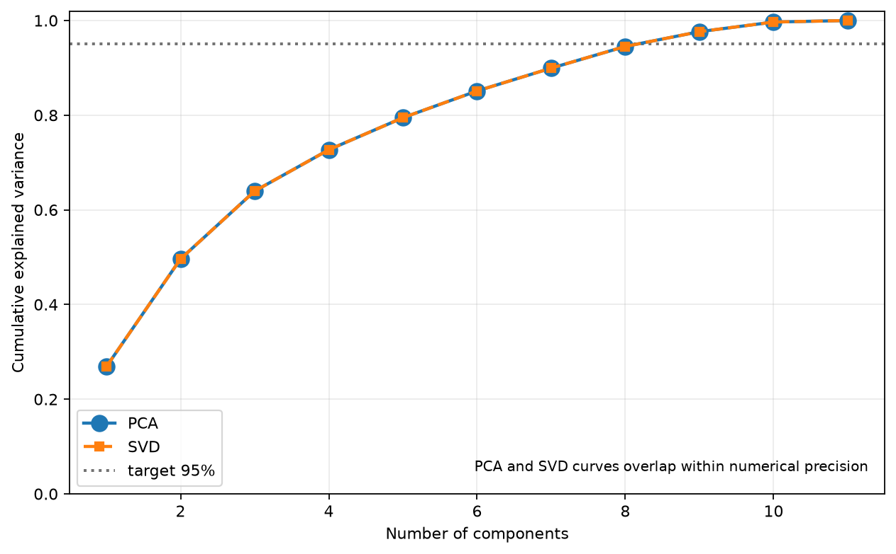
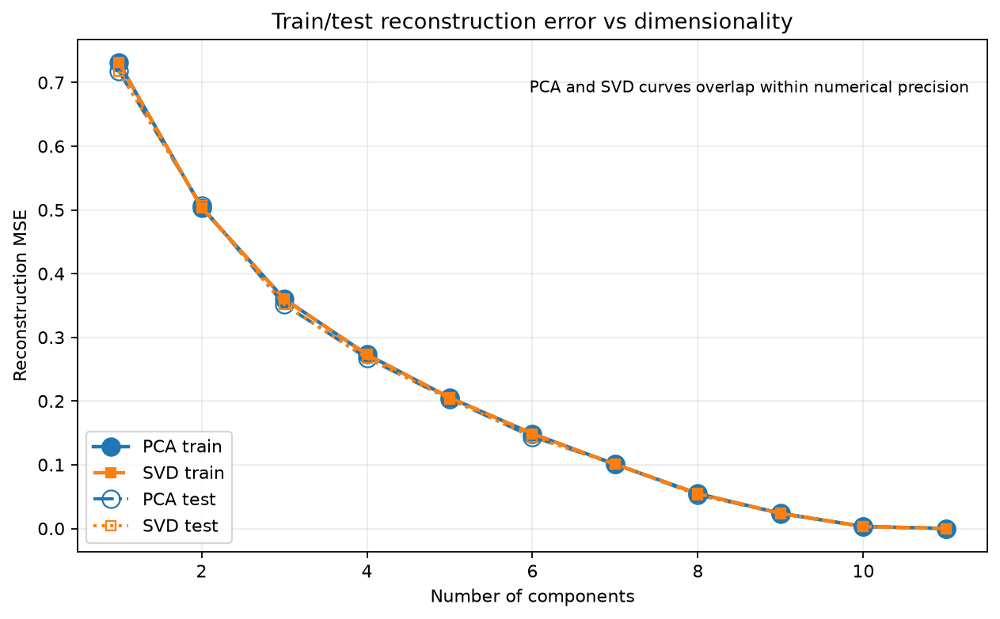
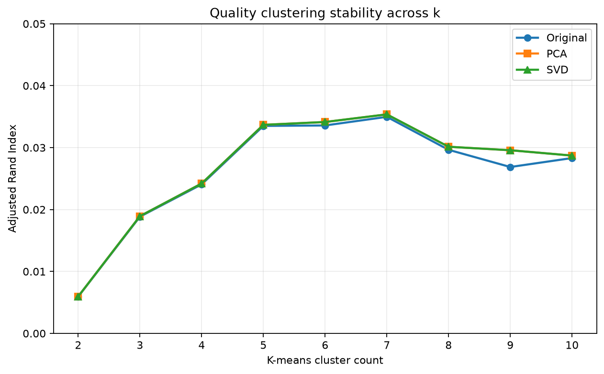
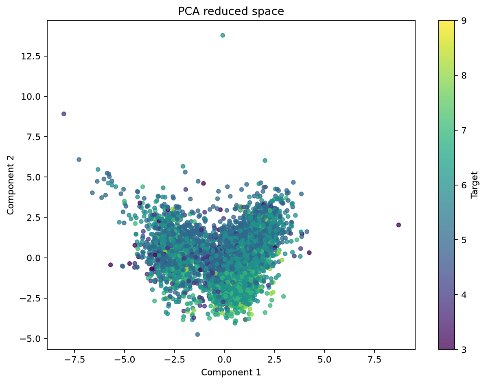
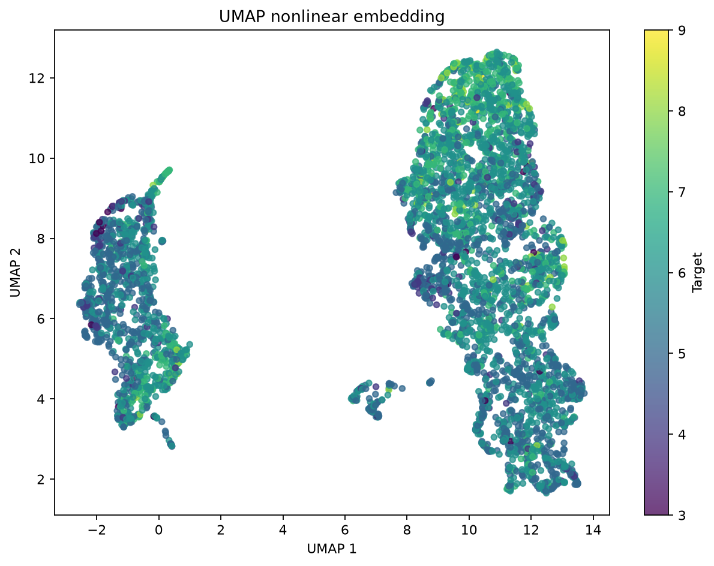

# Spectral Learning

Production-oriented toolkit для уменьшения размерности на основе **PCA и SVD, собранных из базовых NumPy-примитивов**. Проект включает подготовку табличных данных, выбор числа компонент по сохранённой дисперсии, held-out reconstruction diagnostics, оценку кластеризации, переиспользуемые train/inference-артефакты, интерпретируемые визуализации, nonlinear t-SNE/UMAP эксперименты и спектральные применения к изображениям и сигналам.

По умолчанию используется UCI Wine Quality, но CLI принимает и другие числовые CSV-датасеты.

· [English version](README.md)

## 📋 Содержание

- [🚀 Быстрый старт](#-быстрый-старт)
- [📝 О проекте](#-о-проекте)
- [✨ Возможности](#-возможности)
- [🔄 Архитектура](#-архитектура)
- [🧠 PCA и SVD](#-pca-и-svd)
- [🍷 Датасет и preprocessing](#-датасет-и-preprocessing)
- [⚙️ CLI-сценарии](#️-cli-сценарии)
- [📊 Оценка и интерпретация](#-оценка-и-интерпретация)
- [🖼️ Эталонные графики](#️-эталонные-графики)
- [📦 Переиспользуемые артефакты](#-переиспользуемые-артефакты)
- [🧪 Дополнительные эксперименты](#-дополнительные-эксперименты)
- [✅ Тесты](#-тесты)
- [📁 Структура проекта](#-структура-проекта)
- [⚠️ Инженерные замечания](#️-инженерные-замечания)
- [🧑‍💻 Автор](#-автор)

## 🚀 Быстрый старт

### Требования

- Python `3.11+`
- интернет нужен только для необязательного шага скачивания датасета

### Клонирование и установка

```bash
git clone https://01.tomorrow-school.ai/git/nyestaye/spectral-learning.git
cd spectral-learning

python -m venv .venv
```

Windows:

```powershell
.venv\Scripts\Activate.ps1
python -m pip install -r requirements.txt
```

Linux / macOS / WSL:

```bash
source .venv/bin/activate
python -m pip install -r requirements.txt
```

### Скачать Wine Quality

```bash
python scripts/download_wine_quality.py
```

Скрипт скачивает официальный архив UCI и создаёт:

```text
data/raw/wine_quality.csv
```

### Сравнить PCA и SVD

```bash
python main.py compare \
  --input data/raw/wine_quality.csv \
  --variance-threshold 0.95
```

Каждый запуск создаёт timestamped-каталог в `artifacts/runs/` с метриками, графиками, параметрами модели и состоянием preprocessing.

## 📝 О проекте

Репозиторий построен как переиспользуемый ML-компонент, а не как одиночный аналитический notebook. PCA и SVD хранят собственное fit-состояние, preprocessing обучается один раз и сохраняется отдельно, а те же артефакты затем можно применять к новым совместимым CSV без повторного расчёта train-статистик.

Основная логика декомпозиции остаётся явной:

- PCA вручную выполняет mean centering, построение covariance matrix, `numpy.linalg.eig`, сортировку eigenvalues, выбор компонент и projection;
- SVD выполняет centering, `numpy.linalg.svd`, выбор singular directions, projection и reconstruction;
- `sklearn.decomposition.PCA`, `TruncatedSVD` и SciPy SVD helpers не используются;
- scikit-learn в основном PCA/SVD pipeline применяется только для K-means и evaluation metrics.

По умолчанию preprocessing и reducer fit-ятся на детерминированной train-части данных, после чего весь датасет только трансформируется. Held-out строки используются для reconstruction generalization diagnostics без повторного fit. Это воспроизводит разделение, необходимое при обработке будущих production-данных.

## ✨ Возможности

### Spectral reduction

- PCA через явные covariance/eigendecomposition шаги;
- SVD reduction вокруг NumPy matrix decomposition;
- `fit`, `transform`, `fit_transform`, `inverse_transform`;
- ручное число компонент или автоматический variance threshold;
- детерминированная sign convention для стабильных loadings/embeddings;
- explained variance и cumulative explained variance;
- reconstruction MSE и relative Frobenius error;
- feature loadings для интерпретации компонент.

### Data pipeline

- автоматическое определение разделителя CSV;
- проверка duplicate headers до того, как pandas успеет переименовать их;
- понятная обработка пустых и malformed CSV;
- проверка target;
- удаление дубликатов строк в training dataset;
- поиск числовых признаков;
- нормализация NaN/Inf;
- median imputation по train-статистике;
- standardization по train-статистике;
- обработка constant features;
- строгая проверка inference schema.

### Evaluation

- K-means на исходном стандартизированном пространстве;
- K-means на PCA и SVD representations;
- inertia;
- Silhouette Score;
- Calinski-Harabasz Score;
- Davies-Bouldin Score;
- Adjusted Rand Index при наличии reference labels;
- Normalized Mutual Information при наличии reference labels;
- diagnostic clustering sweep `k=2..10` для проверки устойчивости выводов по target;
- сравнение `wine_type` separability: original space → PCA 2D → SVD 2D;
- train/test reconstruction metrics и generalization gap;
- reconstruction curve по nested prefixes одного train-fitted basis для каждого метода.

### Reproducibility

- детерминированный random seed;
- сохранённые preprocessing statistics;
- сохранённые параметры PCA/SVD в compressed NumPy artifacts без pickle;
- JSON с метриками и интерпретацией;
- timestamped run directories;
- явные train fraction и component-selection settings.

## 🔄 Архитектура

```text
                    +----------------------+
                    |      input CSV       |
                    +----------+-----------+
                               |
                               v
                    +----------------------+
                    | load / validate data |
                    +----------+-----------+
                               |
                               v
                    +----------------------+
                    | train-only fit       |
                    | impute + standardize |
                    +----------+-----------+
                               |
                     +---------+---------+
                     |                   |
                     v                   v
             +---------------+   +---------------+
             | PCA from      |   | SVD reduction |
             | covariance +  |   | via NumPy SVD |
             | eig           |   |               |
             +-------+-------+   +-------+-------+
                     |                   |
                     +---------+---------+
                               |
             +-----------------+------------------+
             |                 |                  |
             v                 v                  v
       +-----------+     +-----------+      +-----------+
       | clustering|     | plots and |      | inverse   |
       | metrics   |     | loadings  |      | transform |
       +-----+-----+     +-----+-----+      +-----+-----+
             |                 |                  |
             +-----------------+------------------+
                               |
                               v
                    +----------------------+
                    | persisted run bundle |
                    | NPZ + JSON + CSV     |
                    +----------+-----------+
                               |
                               v
                    +----------------------+
                    | future CSV transform |
                    +----------------------+
```

## 🧠 PCA и SVD

### PCA

`PCAFromScratch` реализует полный алгоритм:

1. вычитание среднего по каждому признаку;
2. вычисление covariance matrix;
3. получение eigenvalues/eigenvectors через `numpy.linalg.eig`;
4. сортировка eigenpairs по убыванию eigenvalue;
5. перевод eigenvalues в explained-variance ratios;
6. выбор числа сохраняемых компонент;
7. применение детерминированной sign convention;
8. projection центрированных данных на выбранные eigenvectors;
9. reconstruction через `inverse_transform`.

### SVD

`SVDFromScratch` выполняет:

1. mean centering;
2. `U, Σ, Vᵀ = numpy.linalg.svd(X)`;
3. преобразование singular values во вклад в дисперсию;
4. выбор top-k right-singular vectors;
5. ту же sign convention, что и PCA;
6. projection в latent space;
7. low-rank reconstruction.

Для центрированных данных PCA eigenvectors и SVD right-singular vectors описывают одно principal subspace с точностью до floating-point эффектов и допустимых вращений внутри degenerate eigenspaces. Обычная sign ambiguity нормализуется для стабильной визуальной подачи.

Подробная математика и определения метрик находятся в [docs/METHODS.md](docs/METHODS.md).

## 🍷 Датасет и preprocessing

По умолчанию используется UCI Wine Quality. Downloader объединяет red и white wine tables и добавляет `wine_type` как metadata column, не входящую в feature matrix.

Числовые признаки включают acidity measures, sugar, chlorides, sulfur dioxide, density, pH, sulphates и alcohol. `quality` используется как reference target для внешнего сравнения кластеров и не передаётся в PCA/SVD.

`TabularPreprocessor` отдельно сохраняет:

- точный порядок features;
- training median для каждого признака;
- training mean;
- training standard deviation;
- найденные constant features.

При inference лишние столбцы игнорируются, но все обязательные training features должны присутствовать. Порядок признаков восстанавливается автоматически.

Пользовательский датасет:

```bash
python main.py compare \
  --input data/raw/custom.csv \
  --target class \
  --variance-threshold 0.95
```

Для действительно unlabeled-датасета:

```bash
python main.py compare \
  --input data/raw/custom.csv \
  --target none
```

`--target none` означает, что **ни один столбец не резервируется как target**. Если использовать этот режим на размеченном числовом датасете вроде Wine Quality, бывший числовой target (`quality`) станет обычной feature. Используйте режим только если именно это и требуется по схеме данных.

## ⚙️ CLI-сценарии

### Обучить один reducer

Автоматический выбор размерности:

```bash
python main.py train \
  --input data/raw/wine_quality.csv \
  --method pca \
  --variance-threshold 0.95
```

Явное число компонент:

```bash
python main.py train \
  --input data/raw/wine_quality.csv \
  --method svd \
  --components 5
```

### Сравнить PCA и SVD

```bash
python main.py compare \
  --input data/raw/wine_quality.csv \
  --variance-threshold 0.95 \
  --clusters 6 \
  --train-fraction 0.8 \
  --seed 42
```

Обе модели получают одинаковый preprocessing state и одну train-подвыборку, поэтому сравнение остаётся корректным. `--clusters` остаётся основной пользовательской настройкой кластеризации; отдельно выполняется diagnostic sweep `k=2..10` без выбора post-hoc «лучшего» k.

### Трансформировать новые данные

После training run:

```bash
python main.py transform \
  --input data/raw/new_wines.csv \
  --model artifacts/runs/<run>/pca_model.npz \
  --preprocessor artifacts/runs/<run>/preprocessor.json \
  --output data/processed/new_wines_reduced.csv
```

Эта команда ничего не fit-ит заново: используются сохранённые medians, means, scales и spectral components.

## 📊 Оценка и интерпретация

Обычный comparison run сохраняет:

- cumulative explained-variance comparison;
- PCA 2D/3D embeddings при достаточном числе компонент;
- SVD 2D/3D embeddings;
- heatmaps component loadings;
- train/test reconstruction error vs component count + numeric JSON;
- target clustering sweep (`k=2..10`) + ARI plot при наличии target;
- `wine_type` class counts и original-vs-2D separability metrics;
- target distribution;
- feature distributions;
- correlation heatmap;
- отдельные cluster views для red/white wine при наличии `wine_type`;
- JSON с strongest signed loadings и paired PCA/SVD component cosine similarities.

Размерность обосновывается либо явным `--components`, либо минимальным количеством компонент, которое достигает `--variance-threshold`. Default 95% — это reconstruction/information-retention objective. Отдельный 2D visualization/separability experiment отвечает на другой downstream-вопрос и не заменяет этот threshold.

Если для 95% нужно сохранить большую часть исходных dimensions, это честно интерпретируется как limited linear compressibility, а не маскируется снижением порога после получения результата.

Для unsupervised dimensionality reduction классический supervised overfitting не является основной проблемой. Здесь контролируются более релевантные риски: leakage между train/inference, нестабильный выбор компонент, чрезмерная размерность и information loss. Fit-статистики считаются только по настроенной train-части, если явно не указать `--train-fraction 1.0`. Held-out reconstruction и train/test MSE gap дают прямую проверку поведения train-fitted subspace на unseen rows.

Wine `quality` является ordinal target, тогда как ARI/NMI трактуют значения как nominal classes. Поэтому clustering sweep показывает устойчивость восстановления именно точного partition по quality, а не ordinal predictive quality.

Числовые результаты не захардкожены в документации. Они вычисляются локально и записываются в JSON artifacts.

## 🖼️ Эталонные графики

Графики ниже скопированы из одного успешно пройденного локального запуска Wine Quality и служат компактными примерами результата. Точные метрики и конфигурация по-прежнему берутся из сгенерированных JSON artifacts.

### Сохранённая дисперсия



### Held-out reconstruction



### Устойчивость кластеризации quality



### Линейная 2D-проекция



### Нелинейная 2D-проекция



## 📦 Переиспользуемые артефакты

Пример структуры training output:

```text
artifacts/runs/20260819T184500Z_pca/
├── pca_model.npz
├── preprocessor.json
├── metrics.json
├── component_interpretation.json
├── reduced.csv
├── cumulative_variance.png
├── embedding_2d.png
├── embedding_3d.png
├── component_loadings.png
├── feature_distributions.png
├── feature_correlation.png
└── target_distribution.png
```

Comparison run дополнительно сохраняет обе модели, PCA/SVD plots, `reconstruction_curve.json`, `quality_clustering_sweep.json`, `wine_type_separability.json` при наличии соответствующих данных и subset cluster views.

NPZ хранит numeric arrays и JSON metadata и читается с `allow_pickle=False`.

## 🧪 Дополнительные эксперименты

### Exact NumPy t-SNE

Небольшая exact t-SNE implementation добавлена для nonlinear visualization без готового dimensionality-reduction класса:

```bash
python main.py nonlinear \
  --input data/raw/wine_quality.csv \
  --max-samples 1000 \
  --perplexity 30 \
  --iterations 750
```

Она специально ограничена exploratory sample: exact t-SNE требует O(n²) pairwise work и не поддерживает такой reusable out-of-sample transform, как PCA/SVD.

### UMAP

UMAP вынесен в optional dependency, чтобы базовое окружение PCA/SVD оставалось лёгким:

```bash
python -m pip install -r requirements-extra.txt
python main.py umap \
  --input data/raw/wine_quality.csv \
  --max-samples 5000 \
  --neighbors 15 \
  --min-dist 0.1
```

Команда сохраняет детерминированный двумерный nonlinear embedding и параметры запуска. UMAP используется здесь для exploratory comparison, а не как persisted production reducer.

### SVD image compression

```bash
python main.py bonus-image \
  --input path/to/image.png \
  --ranks 5,20,50,100
```

Для каждого rank сохраняется reconstructed image и считаются MSE, PSNR и примерный storage ratio.

### SVD signal denoising

```bash
python main.py bonus-signal \
  --rank 4 \
  --samples 1000 \
  --noise-std 0.45
```

Synthetic noisy two-frequency signal преобразуется в Hankel trajectory matrix, затем берётся low-rank SVD approximation, после чего одномерный signal восстанавливается diagonal averaging. Default rank равен 4, потому что две реальные синусоиды дают по две фазовые directions в Hankel subspace.

Подробности — в [docs/EXPERIMENTS.md](docs/EXPERIMENTS.md).

## ✅ Тесты

Установить dev dependencies:

```bash
python -m pip install -r requirements-dev.txt
```

Запустить:

```bash
pytest -q
```

Проверяются:

- PCA shapes, variance ordering, reconstruction и persistence;
- deterministic component-sign canonicalization и PCA/SVD alignment на separated spectrum;
- SVD shapes, explained variance, reconstruction и persistence;
- preprocessing imputation, constant features, schema checks и persistence;
- duplicate CSV headers и empty CSV error handling;
- nested train/test reconstruction curves и PCA/SVD reconstruction equivalence;
- end-to-end reduction + K-means;
- sanity exact t-SNE output;
- image compression и signal-denoising primitives.

## 📁 Структура проекта

```text
spectral-learning/
├── data/
│   └── README.md
├── docs/
│   ├── figures/
│   ├── EXPERIMENTS.md
│   └── METHODS.md
├── experiments/
│   ├── __init__.py
│   ├── image_compression.py
│   ├── signal_denoising.py
│   └── umap_embedding.py
├── models/
│   ├── __init__.py
│   ├── pca_model.py
│   ├── svd_model.py
│   └── tsne_model.py
├── scripts/
│   ├── __init__.py
│   └── download_wine_quality.py
├── tests/
│   ├── test_experiments.py
│   ├── test_pca.py
│   ├── test_pipeline.py
│   ├── test_preprocessing.py
│   ├── test_svd.py
│   └── test_tsne.py
├── utils/
│   ├── __init__.py
│   ├── artifacts.py
│   ├── clustering.py
│   ├── data_loader.py
│   ├── interpretation.py
│   ├── matrix_operations.py
│   ├── metrics.py
│   ├── preprocessing.py
│   └── visualization.py
├── .gitignore
├── main.py
├── README.md
├── README_RU.md
├── requirements-dev.txt
├── requirements-extra.txt
├── requirements.txt
└── workflows.py
```

## ⚠️ Инженерные замечания

- PCA/SVD fit-state не пересчитывается во время `transform`.
- Inference требует полный training feature schema и отклоняет несовместимый input.
- Missing и infinite numeric values нормализуются перед median imputation.
- Constant features получают безопасный scale `1.0` и фиксируются в metadata.
- Явный `n_components` имеет приоритет над variance threshold.
- PCA/SVD component signs canonicalized для детерминированной подачи; degenerate eigenspaces всё равно допускают эквивалентные rotated bases.
- Generated datasets, models, metrics и plots игнорируются Git.
- Exact t-SNE и UMAP остаются exploratory paths и отделены от persisted PCA/SVD inference.
- Runtime numbers зависят от локального датасета, versions и hardware, поэтому генерируются при запуске, а не записываются в README заранее.

## 🧑‍💻 Автор

- Nazar Yestayev (@nyestaye)